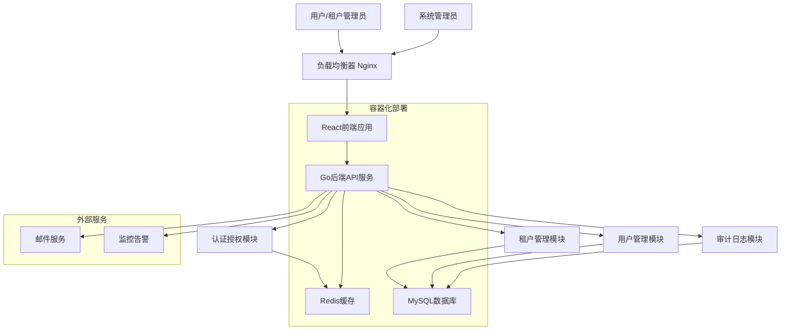

# 多租户系统管理后台 全栈架构文档

*创建日期：2025-08-30*
*版本：v1.0*

---

## 介绍

本文档概述了多租户系统管理后台的完整全栈架构，包括后端系统、前端实现及其集成。它作为AI驱动开发的唯一真实来源，确保整个技术栈的一致性。

这种统一的方法结合了传统上分离的后端和前端架构文档，简化了现代全栈应用的开发流程，其中这些关注点越来越相互关联。

### 启动模板或现有项目

本项目采用绿地开发模式，基于现有技术栈偏好从零开始构建。技术选择基于以下考虑：
- 前端：React + TypeScript + Ant Design，提供企业级UI组件和类型安全
- 后端：Go + GoFrame，采用DDD领域驱动设计，单后端架构
- 数据：MySQL + Redis，关系型数据库配合缓存层
- 仓库：Monorepo结构，前端在frontend/目录下，后端为单独backend目录

### 变更日志
| 日期 | 版本 | 描述 | 作者 |
|------|------|------|------|
| 2025-08-30 | v1.0 | 初始全栈架构文档创建 | AI Architect |

---

## 高级架构

### 技术总结

本多租户系统采用现代全栈架构，结合前后端分离和Monorepo代码组织模式。后端使用Go + GoFrame框架实现单体应用，通过DDD领域驱动设计确保代码的模块化和可维护性。前端基于React + TypeScript + Ant Design + Tailwind CSS构建响应式管理界面，结合Ant Design的组件库和Tailwind的原子化样式，提供优秀的开发体验和用户界面。

系统通过JWT Token实现身份认证，采用RBAC权限模型进行细粒度访问控制。数据层面通过租户ID实现完全的数据隔离，确保多租户环境下的数据安全。前后端通过RESTful API进行通信，支持Docker容器化部署和Kubernetes编排管理。

### 平台和基础设施选择

**平台：** 云原生部署（支持AWS/阿里云/腾讯云）
**核心服务：** Docker + Kubernetes + MySQL + Redis + Nginx
**部署主机和区域：** 多区域部署支持，主要服务区域为中国大陆

基于项目的企业级特性和可扩展性要求，推荐使用云原生部署方案。这种方案提供：
- 高可用性和容错能力
- 弹性伸缩和负载均衡
- 容器化管理和CI/CD集成
- 成本效益和运维简化

### 仓库结构

**结构：** Monorepo单仓库管理
**Monorepo工具：** Go Workspace + npm/yarn workspaces
**包组织策略：** 按功能域和共享组件分层组织

Monorepo结构便于代码共享、依赖管理和统一构建部署，特别适合前后端紧密协作的项目。后端采用DDD领域组织，前端按应用和共享组件分离。

### 高级架构图



### 架构模式

- **分层架构模式：** 前端展示层、API服务层、业务逻辑层、数据访问层清晰分离 - _理由：_ 确保关注点分离和可维护性

- **领域驱动设计 (DDD)：** 后端按业务领域组织代码结构，包含租户域、用户域、权限域 - _理由：_ 支持复杂业务逻辑和未来扩展需求

- **多租户模式：** 共享数据库，通过租户ID实现数据隔离 - _理由：_ 成本效益高且满足数据隔离要求

- **RESTful API模式：** 标准HTTP方法和状态码，支持前后端解耦 - _理由：_ 行业标准，易于理解和集成

- **JWT Token认证：** 无状态认证机制，支持分布式部署 - _理由：_ 可扩展性强，减少服务器端状态管理

- **CQRS模式：** 命令查询职责分离，特别用于审计日志功能 - _理由：_ 优化读写性能，支持复杂查询需求

---

## 技术栈

### 技术栈表

| 类别 | 技术 | 版本 | 目的 | 理由 |
|------|------|------|------|------|
| 前端语言 | TypeScript | ^5.0 | 类型安全的JavaScript超集 | 提供编译时类型检查，减少运行时错误 |
| 前端框架 | React | ^18.0 | 用户界面构建框架 | 组件化开发，生态丰富，团队熟悉 |
| UI组件库 | Ant Design | ^5.0 | 企业级UI设计语言 | 组件丰富，设计统一，适合管理后台 |
| 状态管理 | Zustand | ^4.0 | 轻量级状态管理 | 简单易用，TypeScript友好，性能优秀 |
| 后端语言 | Go | ^1.21 | 高性能编译型语言 | 并发性能强，部署简单，内存占用低 |
| 后端框架 | GoFrame | ^2.5 | 企业级Go开发框架 | DDD支持，功能完整，中文文档丰富 |
| API风格 | RESTful | - | 标准HTTP API设计风格 | 行业标准，易于理解和缓存 |
| 数据库 | MySQL | ^8.0 | 关系型数据库 | 事务支持，数据一致性，运维成熟 |
| 缓存 | Redis | ^7.0 | 内存数据库 | 高性能缓存，支持多种数据结构 |
| 文件存储 | MinIO/云存储 | Latest | 对象存储服务 | S3兼容，私有化部署支持 |
| 认证授权 | JWT + RBAC | - | 无状态认证和角色权限 | 可扩展，支持分布式，细粒度控制 |
| 前端测试 | Vitest + Testing Library | Latest | 前端单元和集成测试 | 快速，TypeScript原生支持 |
| 后端测试 | Go Test + Testify | Latest | 后端单元和集成测试 | Go原生测试框架，断言库丰富 |
| E2E测试 | Playwright | Latest | 端到端自动化测试 | 跨浏览器支持，API测试能力强 |
| 构建工具 | Vite | ^5.0 | 前端构建工具 | 快速开发体验，现代化构建 |
| 打包工具 | Docker | Latest | 容器化打包部署 | 一致环境，便于部署和扩展 |
| IaC工具 | Docker Compose/K8s | Latest | 基础设施即代码 | 声明式配置，版本化管理 |
| CI/CD | GitHub Actions | - | 持续集成和部署 | 集成度高，配置灵活，成本低 |
| 监控 | Prometheus + Grafana | Latest | 指标收集和可视化 | 云原生标准，功能强大 |
| 日志 | GoFrame Log + ELK | Latest | 结构化日志和分析 | 集中式日志，搜索分析能力强 |
| CSS框架 | Tailwind CSS | ^3.0 | 原子化CSS框架 | 快速开发，高度可定制，与Ant Design完美配合 |

---

## 数据模型

### Tenant (租户)

**目的：** 表示系统中的租户组织，实现多租户数据隔离

**关键属性：**
- id: string - 租户唯一标识符
- name: string - 租户名称
- code: string - 租户代码（用于子域名等）
- status: TenantStatus - 租户状态（活跃/暂停/禁用）
- config: TenantConfig - 租户配置信息
- createdAt: Date - 创建时间
- updatedAt: Date - 更新时间

#### TypeScript接口

```typescript
interface Tenant {
  id: string;
  name: string;
  code: string;
  status: 'active' | 'suspended' | 'disabled';
  config: {
    maxUsers: number;
    features: string[];
    theme?: string;
    domain?: string;
  };
  adminUserId?: string;
  createdAt: Date;
  updatedAt: Date;
}

enum TenantStatus {
  Active = 'active',
  Suspended = 'suspended', 
  Disabled = 'disabled'
}
```

#### 关系
- 一对多：一个租户可以有多个用户
- 一对一：一个租户有一个管理员用户

### User (用户)

**目的：** 表示系统用户，支持系统管理员和租户用户两种角色

**关键属性：**
- id: string - 用户唯一标识符
- tenantId: string - 所属租户ID（系统管理员为空）
- username: string - 用户名
- email: string - 邮箱地址
- hashedPassword: string - 加密后的密码
- roles: Role[] - 用户角色列表
- profile: UserProfile - 用户资料
- status: UserStatus - 用户状态

#### TypeScript接口

```typescript
interface User {
  id: string;
  tenantId?: string; // 为空表示系统管理员
  username: string;
  email: string;
  hashedPassword: string;
  roles: Role[];
  profile: {
    firstName: string;
    lastName: string;
    avatar?: string;
    phone?: string;
  };
  status: 'active' | 'inactive' | 'locked';
  lastLoginAt?: Date;
  createdAt: Date;
  updatedAt: Date;
}
```

#### 关系
- 多对一：多个用户属于一个租户
- 多对多：用户可以有多个角色

### Role (角色)

**目的：** 定义用户角色和权限集合，实现RBAC权限控制

**关键属性：**
- id: string - 角色唯一标识符
- tenantId: string - 所属租户ID（系统角色为空）
- name: string - 角色名称
- code: string - 角色代码
- permissions: Permission[] - 权限列表
- isSystem: boolean - 是否为系统内置角色

#### TypeScript接口

```typescript
interface Role {
  id: string;
  tenantId?: string; // 为空表示系统角色
  name: string;
  code: string;
  description?: string;
  permissions: Permission[];
  isSystem: boolean;
  createdAt: Date;
  updatedAt: Date;
}
```

#### 关系
- 多对多：角色可以分配给多个用户
- 多对多：角色可以包含多个权限

### Permission (权限)

**目的：** 定义系统中的具体权限点，支持细粒度访问控制

**关键属性：**
- id: string - 权限唯一标识符
- name: string - 权限名称
- code: string - 权限代码
- resource: string - 资源名称
- action: string - 操作类型
- scope: PermissionScope - 权限范围

#### TypeScript接口

```typescript
interface Permission {
  id: string;
  name: string;
  code: string; // 如：tenant.create, user.read
  resource: string; // 如：tenant, user, role
  action: string; // 如：create, read, update, delete
  scope: 'system' | 'tenant' | 'self';
  description?: string;
  isSystem: boolean;
}
```

#### 关系
- 多对多：权限可以分配给多个角色

### AuditLog (审计日志)

**目的：** 记录系统中的重要操作，用于审计和监控

**关键属性：**
- id: string - 日志唯一标识符
- tenantId: string - 租户ID
- userId: string - 操作用户ID
- action: string - 操作类型
- resource: string - 操作资源
- details: object - 操作详情
- timestamp: Date - 操作时间

#### TypeScript接口

```typescript
interface AuditLog {
  id: string;
  tenantId?: string;
  userId: string;
  action: string; // create, update, delete, login, logout
  resource: string; // user, tenant, role, permission
  resourceId?: string;
  details: {
    before?: any;
    after?: any;
    metadata: Record<string, any>;
  };
  ipAddress?: string;
  userAgent?: string;
  timestamp: Date;
}
```

#### 关系
- 多对一：多个日志记录属于一个租户
- 多对一：多个日志记录属于一个用户

---

## API规格

### REST API规格

```yaml
openapi: 3.0.0
info:
  title: 多租户系统管理后台 API
  version: 1.0.0
  description: 支持多租户的系统管理后台RESTful API接口
servers:
  - url: https://api.example.com/v1
    description: 生产环境
  - url: http://localhost:8000/v1  
    description: 开发环境

paths:
  # 认证相关
  /auth/login:
    post:
      summary: 用户登录
      tags: [Authentication]
      requestBody:
        required: true
        content:
          application/json:
            schema:
              type: object
              properties:
                email:
                  type: string
                password:
                  type: string
                tenantCode:
                  type: string
                  description: 租户代码（系统管理员可为空）
      responses:
        '200':
          description: 登录成功
          content:
            application/json:
              schema:
                type: object
                properties:
                  token:
                    type: string
                  user:
                    $ref: '#/components/schemas/User'
                    
  # 租户管理
  /tenants:
    get:
      summary: 获取租户列表
      tags: [Tenants]
      security:
        - BearerAuth: []
      parameters:
        - name: page
          in: query
          schema:
            type: integer
        - name: limit
          in: query
          schema:
            type: integer
        - name: status
          in: query
          schema:
            type: string
            enum: [active, suspended, disabled]
      responses:
        '200':
          description: 租户列表
          content:
            application/json:
              schema:
                type: object
                properties:
                  data:
                    type: array
                    items:
                      $ref: '#/components/schemas/Tenant'
                  pagination:
                    $ref: '#/components/schemas/Pagination'
    post:
      summary: 创建租户
      tags: [Tenants]
      security:
        - BearerAuth: []
      requestBody:
        required: true
        content:
          application/json:
            schema:
              $ref: '#/components/schemas/CreateTenantRequest'
      responses:
        '201':
          description: 租户创建成功
          content:
            application/json:
              schema:
                $ref: '#/components/schemas/Tenant'

  /tenants/{tenantId}:
    get:
      summary: 获取租户详情
      tags: [Tenants]
      security:
        - BearerAuth: []
      parameters:
        - name: tenantId
          in: path
          required: true
          schema:
            type: string
      responses:
        '200':
          description: 租户详情
          content:
            application/json:
              schema:
                $ref: '#/components/schemas/Tenant'
    put:
      summary: 更新租户
      tags: [Tenants]  
      security:
        - BearerAuth: []
      parameters:
        - name: tenantId
          in: path
          required: true
          schema:
            type: string
      requestBody:
        required: true
        content:
          application/json:
            schema:
              $ref: '#/components/schemas/UpdateTenantRequest'
      responses:
        '200':
          description: 更新成功
          content:
            application/json:
              schema:
                $ref: '#/components/schemas/Tenant'

  # 用户管理  
  /users:
    get:
      summary: 获取用户列表
      tags: [Users]
      security:
        - BearerAuth: []
      parameters:
        - name: tenantId
          in: query
          schema:
            type: string
          description: 租户ID（系统管理员可查看所有）
        - name: page
          in: query
          schema:
            type: integer
        - name: limit
          in: query
          schema:
            type: integer
      responses:
        '200':
          description: 用户列表
          content:
            application/json:
              schema:
                type: object
                properties:
                  data:
                    type: array
                    items:
                      $ref: '#/components/schemas/User'
                  pagination:
                    $ref: '#/components/schemas/Pagination'
    post:
      summary: 创建用户
      tags: [Users]
      security:
        - BearerAuth: []
      requestBody:
        required: true
        content:
          application/json:
            schema:
              $ref: '#/components/schemas/CreateUserRequest'
      responses:
        '201':
          description: 用户创建成功
          content:
            application/json:
              schema:
                $ref: '#/components/schemas/User'

components:
  securitySchemes:
    BearerAuth:
      type: http
      scheme: bearer
      bearerFormat: JWT
      
  schemas:
    Tenant:
      type: object
      properties:
        id:
          type: string
        name:
          type: string
        code:
          type: string
        status:
          type: string
          enum: [active, suspended, disabled]
        config:
          type: object
        createdAt:
          type: string
          format: date-time
        updatedAt:
          type: string
          format: date-time
          
    User:
      type: object
      properties:
        id:
          type: string
        tenantId:
          type: string
          nullable: true
        username:
          type: string
        email:
          type: string
        profile:
          type: object
        status:
          type: string
          enum: [active, inactive, locked]
        roles:
          type: array
          items:
            $ref: '#/components/schemas/Role'
        createdAt:
          type: string
          format: date-time
          
    Role:
      type: object
      properties:
        id:
          type: string
        name:
          type: string
        code:
          type: string
        permissions:
          type: array
          items:
            $ref: '#/components/schemas/Permission'
            
    Permission:
      type: object
      properties:
        id:
          type: string
        name:
          type: string
        code:
          type: string
        resource:
          type: string
        action:
          type: string
        scope:
          type: string
          enum: [system, tenant, self]
          
    Pagination:
      type: object
      properties:
        page:
          type: integer
        limit:
          type: integer
        total:
          type: integer
        pages:
          type: integer
          
    CreateTenantRequest:
      type: object
      required: [name, code]
      properties:
        name:
          type: string
        code:
          type: string
        config:
          type: object
        adminUser:
          type: object
          properties:
            username:
              type: string
            email:
              type: string
            password:
              type: string
              
    UpdateTenantRequest:
      type: object
      properties:
        name:
          type: string
        status:
          type: string
          enum: [active, suspended, disabled]
        config:
          type: object
          
    CreateUserRequest:
      type: object
      required: [username, email, password]
      properties:
        tenantId:
          type: string
        username:
          type: string
        email:
          type: string
        password:
          type: string
        profile:
          type: object
        roleIds:
          type: array
          items:
            type: string
```

---

## 组件

### 认证授权服务

**职责：** 处理用户认证、JWT Token管理和权限验证

**关键接口：**
- `Login(credentials) -> AuthResult`
- `ValidateToken(token) -> User`
- `CheckPermission(user, resource, action) -> boolean`

**依赖：** Redis缓存、用户服务、权限服务

**技术栈详情：** GoFrame中间件实现，JWT库处理Token生成和验证，Redis存储Session信息

### 租户管理服务

**职责：** 管理租户的生命周期，包括创建、配置、状态管理

**关键接口：**
- `CreateTenant(tenantData) -> Tenant`
- `UpdateTenant(id, updates) -> Tenant`
- `GetTenantByCode(code) -> Tenant`

**依赖：** 数据库服务、用户服务、邮件服务

**技术栈详情：** GoFrame领域服务，MySQL事务支持，邮件通知集成

### 用户管理服务

**职责：** 管理用户账户、角色分配和用户资料

**关键接口：**
- `CreateUser(userData) -> User`
- `AssignRoles(userId, roleIds) -> boolean`
- `GetUsersByTenant(tenantId) -> User[]`

**依赖：** 数据库服务、权限服务、认证服务

**技术栈详情：** GoFrame实体管理，密码加密，多租户数据隔离

### 权限管理服务

**职责：** 管理角色和权限定义，提供权限检查功能

**关键接口：**
- `CreateRole(roleData) -> Role`
- `AssignPermissions(roleId, permissionIds) -> boolean`
- `CheckUserPermission(userId, resource, action) -> boolean`

**依赖：** 数据库服务、缓存服务

**技术栈详情：** RBAC模型实现，权限缓存机制，层次化权限继承

### 审计日志服务

**职责：** 记录和查询系统操作审计日志

**关键接口：**
- `LogOperation(auditData) -> AuditLog`
- `QueryLogs(filters) -> AuditLog[]`
- `ExportLogs(filters) -> File`

**依赖：** 数据库服务、搜索引擎

**技术栈详情：** 异步日志写入，Elasticsearch集成，CQRS模式查询

### 前端React应用

**职责：** 提供用户界面和用户交互体验

**关键接口：**
- 页面路由和导航
- 组件状态管理
- API请求和响应处理

**依赖：** 后端API服务、CDN服务

**技术栈详情：** React + TypeScript + Ant Design + Tailwind CSS，Zustand状态管理，Vite构建

---

## 统一项目结构

```plaintext
multi-tenant-admin/
├── .github/                    # CI/CD workflows
│   └── workflows/
│       ├── ci.yaml
│       └── deploy.yaml
├── frontend/                   # 前端应用包
│   ├── apps/                   # 应用程序
│   │   ├── admin-web/          # 管理后台前端
│   │   │   ├── src/
│   │   │   │   ├── components/     # UI组件
│   │   │   │   ├── pages/          # 页面组件
│   │   │   │   ├── hooks/          # 自定义Hooks
│   │   │   │   ├── services/       # API客户端服务
│   │   │   │   ├── stores/         # Zustand状态管理
│   │   │   │   ├── styles/         # Tailwind CSS样式
│   │   │   │   └── utils/          # 前端工具函数
│   │   │   ├── public/             # 静态资源
│   │   │   ├── tests/              # 前端测试
│   │   │   ├── tailwind.config.js  # Tailwind CSS配置
│   │   │   ├── postcss.config.js   # PostCSS配置
│   │   │   ├── Dockerfile          # 前端Docker镜像
│   │   │   └── package.json
│   ├── packages/               # 共享包
│   │   ├── shared/             # 共享类型和工具
│   │   │   ├── src/
│   │   │   │   ├── types/          # TypeScript接口
│   │   │   │   ├── constants/      # 共享常量
│   │   │   │   └── utils/          # 共享工具函数
│   │   │   └── package.json
│   │   ├── ui/                 # 共享UI组件
│   │   │   ├── src/
│   │   │   └── package.json
│   │   └── config/             # 共享配置
│   │       ├── eslint/
│   │       ├── typescript/
│   │       ├── tailwind/           # Tailwind共享配置
│   │       └── jest/
├── backend/                    # 后端应用
│   ├── cmd/                    # 应用入口
│   │   └── main.go
│   ├── api/                    # API控制器层
│   │   ├── handlers/           # HTTP处理器
│   │   ├── middleware/         # 中间件
│   │   └── routes/             # 路由定义
│   ├── domain/                 # 领域层
│   │   ├── tenant/             # 租户领域
│   │   ├── user/               # 用户领域
│   │   ├── auth/               # 认证领域
│   │   └── audit/              # 审计领域
│   ├── application/            # 应用服务层
│   │   ├── tenant/             # 租户应用服务
│   │   ├── user/               # 用户应用服务
│   │   ├── auth/               # 认证应用服务
│   │   └── audit/              # 审计应用服务
│   ├── repository/             # 数据访问层
│   │   ├── mysql/              # MySQL实现
│   │   ├── redis/              # Redis实现
│   │   └── interfaces/         # 仓储接口
│   ├── infr/                   # 基础设施层
│   │   ├── database/           # 数据库连接
│   │   ├── cache/              # 缓存配置
│   │   ├── email/              # 邮件服务
│   │   └── storage/            # 文件存储
│   ├── pkg/                    # 共享包
│   │   ├── utils/              # 工具函数
│   │   ├── errors/             # 错误定义
│   │   ├── config/             # 配置结构
│   │   └── logger/             # 日志工具
│   ├── tests/                  # 后端测试
│   ├── configs/                # 配置文件
│   ├── docker-compose.yaml     # Docker环境配置
│   ├── Dockerfile              # 后端Docker镜像
│   ├── go.work                 # Go Workspace配置
│   └── go.mod                  # Go模块配置 (github.com/gofromzero/project_temp/backend)
├── scripts/                    # 构建部署脚本
├── docs/                       # 文档
│   ├── prd.md
│   ├── front-end-spec.md
│   └── architecture.md
├── .env.example                # 环境变量模板
└── README.md                   # 项目说明文档
```

---

## 开发工作流程

### 本地开发设置

#### 前置条件

```bash
# 安装Go 1.21+
go version

# 安装Node.js 18+
node --version

# 安装Docker
docker --version

# 安装MySQL和Redis（或使用Docker）
mysql --version
redis-cli --version
```

#### 初始设置

```bash
# 克隆仓库
git clone https://github.com/yourorg/multi-tenant-admin.git
cd multi-tenant-admin

# 初始化Go Workspace
go work init ./backend

# 安装前端依赖
cd frontend
npm install

# 设置环境变量
cp .env.example .env
# 编辑.env文件配置数据库连接等

# 启动依赖服务（MySQL、Redis）
docker-compose up -d mysql redis

# 数据库迁移
cd backend
go run cmd/main.go migrate

# 初始化数据（创建系统管理员）
go run cmd/main.go seed
```

#### 开发命令

```bash
# 启动所有服务（推荐）
npm run dev

# 仅启动前端
cd frontend/apps/admin-web
npm run dev

# 仅启动后端
cd backend
go run cmd/main.go serve

# 运行测试
npm run test        # 前端测试
go test ./...       # 后端测试
npm run test:e2e    # E2E测试
```

### 环境配置

#### 必需环境变量

```bash
# 前端 (.env.local)
VITE_API_URL=http://localhost:8000/v1
VITE_APP_TITLE=多租户系统管理后台

# 后端 (.env)
DB_HOST=localhost
DB_PORT=3306
DB_USER=root
DB_PASSWORD=your_password
DB_NAME=multi_tenant_admin

REDIS_HOST=localhost
REDIS_PORT=6379
REDIS_PASSWORD=

JWT_SECRET=your_jwt_secret_key_here
JWT_EXPIRE_HOURS=24

EMAIL_SMTP_HOST=smtp.example.com
EMAIL_SMTP_PORT=587
EMAIL_USERNAME=noreply@example.com
EMAIL_PASSWORD=your_email_password

# 共享
LOG_LEVEL=info
APP_ENV=development
```

---

## 部署架构

### 部署策略

**前端部署：**
- **平台：** Vercel/Netlify/自建CDN
- **构建命令：** `npm run build`
- **输出目录：** `frontend/apps/admin-web/dist`
- **CDN/边缘：** 全球CDN加速，静态资源缓存

**后端部署：**
- **平台：** Kubernetes集群/云服务器
- **构建命令：** `go build -o app cmd/main.go`
- **部署方法：** Docker容器化部署，多副本负载均衡

### CI/CD流水线

```yaml
name: Build and Deploy
on:
  push:
    branches: [main, develop]
  pull_request:
    branches: [main]

jobs:
  test:
    runs-on: ubuntu-latest
    steps:
      - uses: actions/checkout@v3
      - uses: actions/setup-go@v4
        with:
          go-version: '1.21'
      - uses: actions/setup-node@v3
        with:
          node-version: '18'
      
      # 后端测试
      - name: Run Go tests
        run: |
          cd backend
          go test ./...
      
      # 前端测试
      - name: Install frontend dependencies
        run: |
          cd frontend
          npm ci
      
      - name: Run frontend tests
        run: |
          cd frontend
          npm run test
          
      # E2E测试
      - name: Run E2E tests
        run: |
          npm run test:e2e

  build-and-deploy:
    needs: test
    runs-on: ubuntu-latest
    if: github.ref == 'refs/heads/main'
    steps:
      - uses: actions/checkout@v3
      
      # 构建后端
      - name: Build backend Docker image
        run: |
          docker build -f infrastructure/docker/Dockerfile.backend -t backend:latest .
      
      # 构建前端
      - name: Build frontend
        run: |
          cd frontend
          npm ci
          npm run build
          
      # 部署到生产环境
      - name: Deploy to production
        run: |
          # Kubernetes部署命令
          kubectl apply -f infrastructure/k8s/
```

### 环境配置

| 环境 | 前端URL | 后端URL | 用途 |
|------|---------|---------|------|
| Development | http://localhost:3000 | http://localhost:8000 | 本地开发 |
| Staging | https://staging-admin.example.com | https://staging-api.example.com | 预生产测试 |
| Production | https://admin.example.com | https://api.example.com | 生产环境 |

## 后端架构优化说明

### 架构重构（去除 internal 层）

为了简化项目结构并提升开发体验，我们对后端架构进行了重构：

**主要变更：**
- **移除 internal 层** - 所有模块直接放在 backend 根目录下
- **平坦化结构** - 减少嵌套层级，包导入路径更简洁
- **保持 DDD 分层** - API、领域、应用、仓储、基础设施层次清晰分离

**新架构层次：**
1. **API 层** (`api/`) - HTTP 处理器、中间件、路由
2. **领域层** (`domain/`) - 业务实体和领域逻辑
3. **应用层** (`application/`) - 业务用例编排和应用服务
4. **仓储层** (`repository/`) - 数据访问抽象和实现
5. **基础设施层** (`infr/`) - 外部服务集成
6. **共享包** (`pkg/`) - 跨层共享组件

**架构优势：**
- 📁 更直观的目录结构，便于快速定位代码
- 🔍 简化的包导入路径，如 `backend/domain/tenant` vs `backend/internal/domain/tenant`
- 🏗️ 保持清洁架构原则，确保层次分离和依赖方向
- 🚀 提升开发效率，减少认知负担

这种重构在保持 DDD 架构完整性的同时，显著简化了项目的组织复杂度。

---

全栈架构文档已更新完成！文档涵盖了多租户系统管理后台的完整技术架构，包括：

✅ 高级架构概述和技术选型
✅ 完整的技术栈定义表
✅ 详细的数据模型设计
✅ RESTful API规格说明
✅ 组件架构和职责划分
✅ 优化后的项目结构（去除 internal 层）
✅ 开发工作流程和环境配置
✅ CI/CD部署架构

文档基于现代化的后端架构设计，确保了技术栈的一致性（Go + GoFrame + DDD 后端，React + TS + Ant Design 前端），并详细定义了多租户数据隔离、RBAC权限模型等核心架构决策。