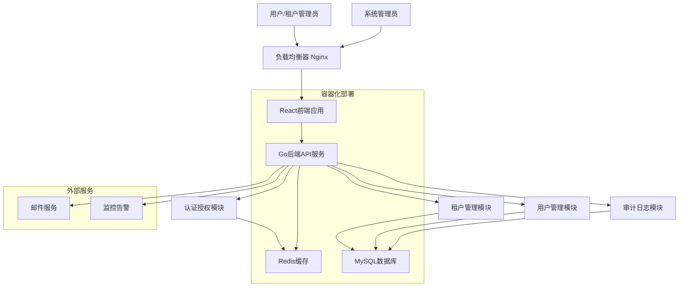

# 高级架构

## 技术总结

本多租户系统采用现代全栈架构，结合前后端分离和Monorepo代码组织模式。后端使用Go + GoFrame框架实现单体应用，通过DDD领域驱动设计确保代码的模块化和可维护性。前端基于React + TypeScript + Ant Design + Tailwind CSS构建响应式管理界面，结合Ant Design的组件库和Tailwind的原子化样式，提供优秀的开发体验和用户界面。

系统通过JWT Token实现身份认证，采用RBAC权限模型进行细粒度访问控制。数据层面通过租户ID实现完全的数据隔离，确保多租户环境下的数据安全。前后端通过RESTful API进行通信，支持Docker容器化部署和Kubernetes编排管理。

## 平台和基础设施选择

**平台：** 云原生部署（支持AWS/阿里云/腾讯云）
**核心服务：** Docker + Kubernetes + MySQL + Redis + Nginx
**部署主机和区域：** 多区域部署支持，主要服务区域为中国大陆

基于项目的企业级特性和可扩展性要求，推荐使用云原生部署方案。这种方案提供：
- 高可用性和容错能力
- 弹性伸缩和负载均衡
- 容器化管理和CI/CD集成
- 成本效益和运维简化

## 仓库结构

**结构：** Monorepo单仓库管理
**Monorepo工具：** Go Workspace + npm/yarn workspaces
**包组织策略：** 按功能域和共享组件分层组织

Monorepo结构便于代码共享、依赖管理和统一构建部署，特别适合前后端紧密协作的项目。后端采用DDD领域组织，前端按应用和共享组件分离。

## 高级架构图

## 架构模式

- **分层架构模式：** 前端展示层、API服务层、业务逻辑层、数据访问层清晰分离 - _理由：_ 确保关注点分离和可维护性

- **领域驱动设计 (DDD)：** 后端按业务领域组织代码结构，包含租户域、用户域、权限域 - _理由：_ 支持复杂业务逻辑和未来扩展需求

- **多租户模式：** 共享数据库，通过租户ID实现数据隔离 - _理由：_ 成本效益高且满足数据隔离要求

- **RESTful API模式：** 标准HTTP方法和状态码，支持前后端解耦 - _理由：_ 行业标准，易于理解和集成

- **JWT Token认证：** 无状态认证机制，支持分布式部署 - _理由：_ 可扩展性强，减少服务器端状态管理

- **CQRS模式：** 命令查询职责分离，特别用于审计日志功能 - _理由：_ 优化读写性能，支持复杂查询需求

---
