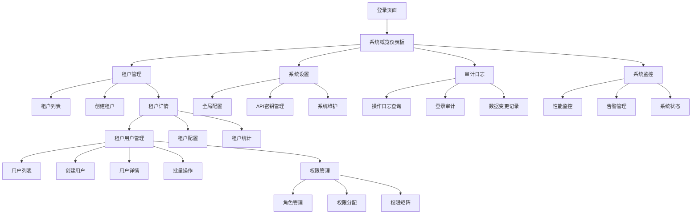
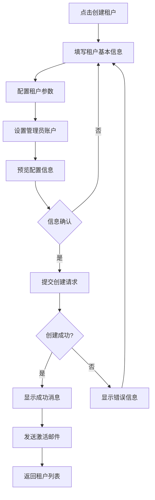
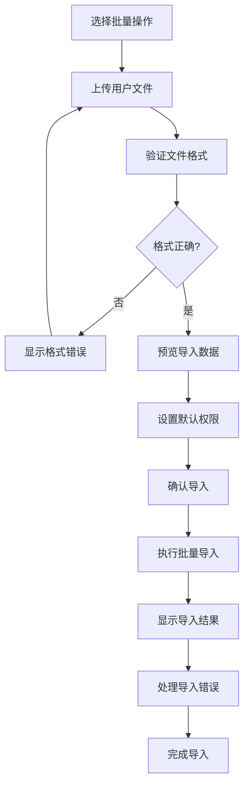
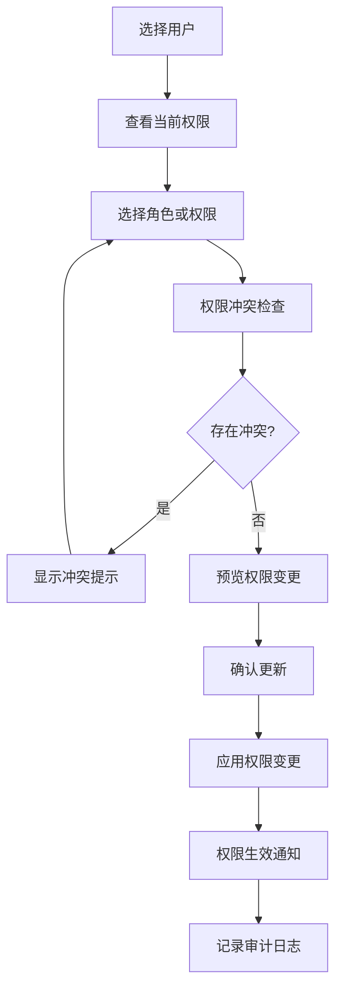

# 多租户系统管理后台 UI/UX规格说明

*创建日期：2025-08-30*
*版本：v1.0*

---

## 介绍

本文档定义了多租户系统管理后台的用户体验目标、信息架构、用户流程和可视化设计规格。它作为视觉设计和前端开发的基础，确保连贯的以用户为中心的体验。

### 整体UX目标和原则

#### 目标用户角色

**系统管理员**：负责整体系统管理的技术专业人员，需要高级功能和操作效率。拥有全局视图，管理所有租户和系统配置，重视数据安全和系统监控。

**租户管理员**：负责管理自己组织内用户的业务人员，优先考虑易用性和清晰指导。专注于租户内部的用户管理和权限分配，需要直观的界面和高效的批量操作。

#### 可用性目标

- **学习易用性**：新的租户管理员可以在10分钟内完成核心用户管理任务
- **使用效率**：系统管理员可以通过最少的点击完成频繁的租户操作
- **错误防护**：对破坏性操作提供清晰的验证和确认机制
- **记忆性**：不频繁的用户可以返回而无需重新学习界面

#### 设计原则

1. **清晰胜过巧妙** - 优先考虑清晰的沟通而非美学创新
2. **渐进式披露** - 只在需要时显示所需内容
3. **一致的模式** - 在整个应用程序中使用熟悉的UI模式
4. **即时反馈** - 每个操作都应有清晰、即时的响应
5. **默认可访问** - 从一开始就为所有用户设计

#### 变更日志
| 日期 | 版本 | 描述 | 作者 |
|------|------|------|------|
| 2025-08-30 | v1.0 | 初始UI/UX规格创建 | Sally (UX Expert) |

---

## 信息架构(IA)

### 站点地图/界面清单

### 导航结构

**主要导航：** 左侧可折叠导航栏，包含系统概览、租户管理、用户管理、权限管理、审计日志、系统设置和监控模块。基于用户角色动态显示可访问的菜单项。

**次级导航：** 内容区域内的标签页或子菜单，用于同一模块内的功能切换。例如租户管理下的"租户列表"、"批量操作"、"导入导出"等。

**面包屑策略：** 显示当前位置的完整路径，支持快速回退到上级页面。格式为：系统概览 > 租户管理 > 租户详情 > 用户管理。

---

## 用户流程

### 租户创建流程

**用户目标：** 系统管理员需要为新客户创建租户账户

**进入点：** 系统概览仪表板、租户管理列表页

**成功标准：** 成功创建租户并发送激活邮件

#### 流程图

#### 边缘情况和错误处理
- 租户名称已存在：显示清晰错误提示，建议替代名称
- 邮件发送失败：创建成功但提醒手动发送激活链接
- 网络连接问题：保存草稿，支持恢复填写进度
- 权限不足：显示权限不足提示，引导联系管理员

**注意事项：** 创建过程支持保存草稿，长时间无操作自动保存，防止数据丢失

### 批量用户管理流程

**用户目标：** 租户管理员需要批量导入和管理用户

**进入点：** 租户用户管理页面

**成功标准：** 成功导入用户并分配适当权限

#### 流程图

#### 边缘情况和错误处理
- 文件格式错误：提供标准模板下载链接
- 重复用户：提供覆盖或跳过选项
- 部分导入失败：显示详细的成功和失败统计
- 文件过大：支持分批处理和进度显示

**注意事项：** 导入过程提供实时进度反馈，支持取消操作

### 权限分配流程

**用户目标：** 系统管理员需要为用户分配和管理权限

**进入点：** 用户详情页面、权限管理页面

**成功标准：** 成功更新用户权限并生效

#### 流程图

#### 边缘情况和错误处理
- 权限冲突：清晰展示冲突原因和解决建议
- 权限不足：管理员权限验证，阻止越权操作
- 批量权限变更：支持批量选择和权限模板应用
- 权限继承：清晰显示继承关系和覆盖规则

**注意事项：** 权限变更立即生效，提供回滚功能用于紧急恢复

---

## 线框图和原型

### 设计文件

**主要设计文件：** 设计原型和详细规格将在Figma中创建，链接待补充

### 关键界面布局

#### 系统概览仪表板

**目的：** 为系统管理员提供系统整体状态的快速概览

**关键元素：**
- 核心指标卡片（租户数量、用户总数、活跃度、系统状态）
- 趋势图表（用户增长趋势、租户活跃度、系统性能）
- 最近活动流（关键操作记录、异常事件提醒）
- 快速操作按钮（创建租户、查看告警、系统设置）

**交互说明：** 指标卡片支持点击查看详细信息，图表支持时间范围筛选，活动流支持实时更新

**设计文件参考：** 待补充Figma链接

#### 租户管理列表页

**目的：** 提供高效的租户管理和批量操作界面

**关键元素：**
- 租户列表表格（名称、状态、用户数、创建时间、操作）
- 搜索和筛选工具栏（按状态、创建时间、用户数范围筛选）
- 批量操作按钮（批量启用/停用、导出、删除）
- 创建租户按钮和导入功能

**交互说明：** 表格支持排序和多选，搜索结果实时更新，批量操作需要确认

**设计文件参考：** 待补充Figma链接

#### 用户管理界面

**目的：** 为租户管理员提供用户管理的完整功能

**关键元素：**
- 用户列表表格（姓名、邮箱、角色、状态、最后登录）
- 用户创建和编辑表单（基本信息、权限设置、自定义字段）
- 批量导入/导出界面（文件上传、模板下载、进度显示）
- 权限分配面板（角色选择、权限矩阵、继承关系）

**交互说明：** 用户列表按租户隔离显示，表单支持实时验证，批量操作提供详细反馈

**设计文件参考：** 待补充Figma链接

#### 权限管理界面

**目的：** 提供直观的权限配置和管理工具

**关键元素：**
- 角色列表和权限矩阵（可视化权限关系）
- 权限分配拖拽界面（支持拖拽式权限配置）
- 权限预览和确认面板（变更前后对比）
- 权限模板管理（常用权限组合保存和应用）

**交互说明：** 权限矩阵支持实时编辑，拖拽操作有视觉反馈，权限变更需要确认

**设计文件参考：** 待补充Figma链接

---

## 组件库/设计系统

### 设计系统方法

**设计系统方法：** 基于Ant Design 5.x + Tailwind CSS构建定制化企业级设计系统，结合Ant Design的组件库和Tailwind CSS的原子化样式系统，保持设计一致性同时提供灵活的样式定制能力。

### 核心组件

#### DataTable 数据表格

**目的：** 统一的数据展示和操作组件，支持大数据量和复杂交互

**变体：** 基础表格、可选择表格、可编辑表格、树形表格

**状态：** 加载中、空数据、错误状态、排序状态、筛选状态

**使用指南：** 用于所有数据列表展示，统一分页、排序、筛选交互模式

#### BatchOperationBar 批量操作栏

**目的：** 提供统一的批量操作用户界面

**变体：** 固定式、浮动式、抽屉式

**状态：** 未选择、已选择、执行中、完成

**使用指南：** 在有多选需求的列表页面使用，操作按钮根据权限动态显示

#### StatusIndicator 状态指示器

**目的：** 统一的状态显示组件，支持多种状态类型

**变体：** 圆点式、标签式、进度式、图标式

**状态：** 成功、警告、错误、处理中、禁用

**使用指南：** 用于显示租户状态、用户状态、系统状态等

#### PermissionMatrix 权限矩阵

**目的：** 可视化权限关系的专业组件

**变体：** 网格式、树形式、列表式

**状态：** 查看模式、编辑模式、保存中、冲突状态

**使用指南：** 用于权限管理页面，支持拖拽和批量操作

#### ConfirmationModal 确认对话框

**目的：** 统一的操作确认用户界面，特别用于危险操作

**变体：** 简单确认、详细确认、输入确认

**状态：** 等待确认、执行中、成功、失败

**使用指南：** 删除、批量操作等重要操作必须使用确认对话框

---

## 品牌和风格指南

### 视觉识别

**品牌指南：** 遵循企业级产品设计语言，体现专业性、可信性和效率

### 色彩调色板

| 色彩类型 | 十六进制代码 | 使用说明 |
|----------|--------------|----------|
| 主色 | #1677FF | 主要操作按钮、链接、重要状态指示 |
| 次要色 | #722ED1 | 次要操作、辅助信息展示 |
| 强调色 | #13C2C2 | 特殊状态、突出信息 |
| 成功色 | #52C41A | 成功状态、正向反馈、确认操作 |
| 警告色 | #FAAD14 | 警告状态、重要提醒、需要注意的信息 |
| 错误色 | #FF4D4F | 错误状态、危险操作、失败反馈 |
| 中性色 | #262626, #595959, #8C8C8C | 文本颜色、边框、背景色 |

### 字体排版

#### 字体系列
- **主要字体**：-apple-system, BlinkMacSystemFont, 'Segoe UI', Roboto, sans-serif
- **次要字体**：'Chinese Quote', -apple-system, BlinkMacSystemFont, 'Segoe UI'
- **等宽字体**：'SFMono-Regular', Consolas, 'Liberation Mono', Menlo, Courier

#### 字体比例

| 元素 | 尺寸 | 字重 | 行高 |
|------|------|------|------|
| H1 | 32px | 600 | 40px |
| H2 | 24px | 600 | 32px |
| H3 | 20px | 600 | 28px |
| 正文 | 14px | 400 | 22px |
| 小号 | 12px | 400 | 20px |

### 图标系统

**图标库：** Ant Design Icons + 自定义业务图标

**使用指南：** 保持图标风格一致，尺寸规范，合理使用颜色和状态

### 间距和布局

**网格系统：** 基于24px基准的8点网格系统

**间距比例：** 4px, 8px, 12px, 16px, 24px, 32px, 48px, 64px

---

## 可访问性要求

### 合规目标

**标准：** WCAG 2.1 AA级别合规

### 关键要求

**视觉：**
- 颜色对比度：正文文本4.5:1，大文本3:1，UI组件3:1
- 焦点指示器：所有可交互元素必须有清晰的焦点样式
- 文本大小：支持200%缩放而不丢失功能

**交互：**
- 键盘导航：所有功能必须可通过键盘访问
- 屏幕阅读器支持：所有内容和功能对屏幕阅读器可用
- 触摸目标：最小44x44px的触摸区域

**内容：**
- 替代文本：所有信息性图片提供有意义的alt文本
- 标题结构：使用语义化的标题层级结构
- 表单标签：所有表单控件有关联的标签

### 测试策略

使用自动化测试工具（axe-core）进行基础检查，配合手动测试验证键盘导航和屏幕阅读器兼容性。每个主要功能发布前进行可访问性审查。

---

## 响应式策略

### 断点设置

| 断点 | 最小宽度 | 最大宽度 | 目标设备 |
|------|----------|----------|----------|
| Mobile | - | 767px | 手机设备 |
| Tablet | 768px | 1199px | 平板设备 |
| Desktop | 1200px | 1599px | 桌面显示器 |
| Wide | 1600px | - | 宽屏显示器 |

### 适配模式

**布局变化：** 桌面端三栏布局（导航-内容-侧栏），平板端二栏布局（导航-内容），手机端单栏布局

**导航变化：** 桌面端固定左侧导航，平板端可收起导航，手机端抽屉式导航

**内容优先级：** 手机端隐藏次要信息，优先显示核心操作和关键数据

**交互变化：** 手机端使用更大的触摸目标，简化复杂交互，提供手势支持

---

## 动画和微交互

### 动效原则

遵循"有意义的动效"原则，所有动画都应该服务于用户理解和任务完成。使用缓动函数创建自然的动效体验，保持一致的动画时长和风格。

### 关键动画

- **页面切换**：渐隐渐现过渡 (Duration: 300ms, Easing: ease-out)
- **模态框显示**：从中心缩放进入 (Duration: 200ms, Easing: cubic-bezier(0.2, 0, 0.2, 1))
- **列表项加载**：从上到下的层叠动效 (Duration: 150ms, Easing: ease-out)
- **状态变化**：颜色和大小的平滑过渡 (Duration: 200ms, Easing: ease-in-out)
- **悬停反馈**：轻微的缩放和颜色变化 (Duration: 100ms, Easing: ease-out)

---

## 性能考量

### 性能目标

- **页面加载**：首屏内容2秒内显示完成
- **交互响应**：用户操作100ms内响应
- **动画帧率**：保持60fps流畅动画

### 设计策略

实施图片懒加载和渐进式图片加载，使用虚拟滚动处理大数据量列表，实现组件级别的代码分割，优化打包体积。结合Tailwind CSS的原子化类名，避免复杂的CSS选择器和过度的DOM嵌套，通过JIT模式确保CSS包体积最小化。

---

## 下一步行动

### 立即行动

1. 与利益相关者审查UI/UX规格说明
2. 在Figma中创建详细的视觉设计和原型
3. 开发组件库和设计系统的技术实现
4. 建立设计和开发的协作流程

### 设计交接检查清单

- [x] 所有用户流程已文档化
- [x] 组件清单完整
- [x] 可访问性要求已定义
- [x] 响应式策略明确
- [x] 品牌指南已融入
- [x] 性能目标已建立

---

## 检查清单结果

*此部分将在完成UI/UX检查清单后填入结果*