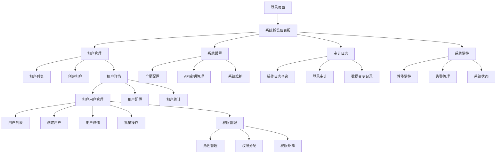

# 信息架构(IA)

## 站点地图/界面清单

## 导航结构

**主要导航：** 左侧可折叠导航栏，包含系统概览、租户管理、用户管理、权限管理、审计日志、系统设置和监控模块。基于用户角色动态显示可访问的菜单项。

**次级导航：** 内容区域内的标签页或子菜单，用于同一模块内的功能切换。例如租户管理下的"租户列表"、"批量操作"、"导入导出"等。

**面包屑策略：** 显示当前位置的完整路径，支持快速回退到上级页面。格式为：系统概览 > 租户管理 > 租户详情 > 用户管理。

---
