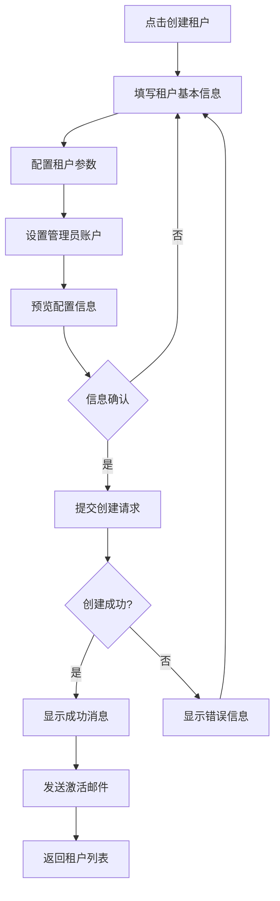
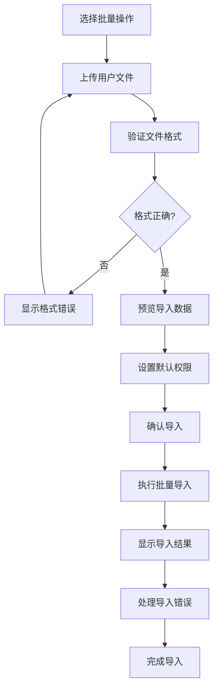
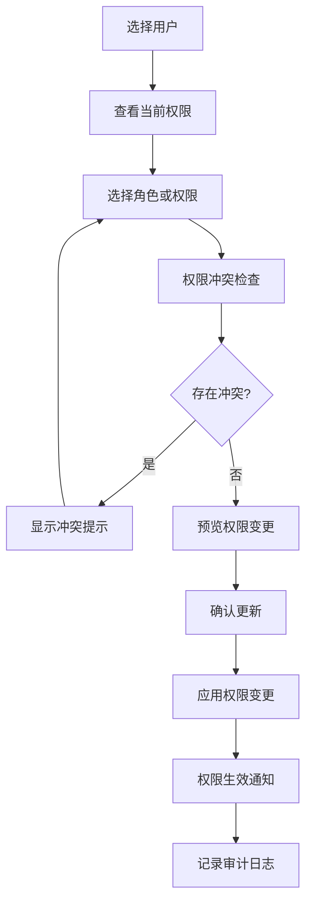

# 用户流程

## 租户创建流程

**用户目标：** 系统管理员需要为新客户创建租户账户

**进入点：** 系统概览仪表板、租户管理列表页

**成功标准：** 成功创建租户并发送激活邮件

### 流程图

### 边缘情况和错误处理
- 租户名称已存在：显示清晰错误提示，建议替代名称
- 邮件发送失败：创建成功但提醒手动发送激活链接
- 网络连接问题：保存草稿，支持恢复填写进度
- 权限不足：显示权限不足提示，引导联系管理员

**注意事项：** 创建过程支持保存草稿，长时间无操作自动保存，防止数据丢失

## 批量用户管理流程

**用户目标：** 租户管理员需要批量导入和管理用户

**进入点：** 租户用户管理页面

**成功标准：** 成功导入用户并分配适当权限

### 流程图

### 边缘情况和错误处理
- 文件格式错误：提供标准模板下载链接
- 重复用户：提供覆盖或跳过选项
- 部分导入失败：显示详细的成功和失败统计
- 文件过大：支持分批处理和进度显示

**注意事项：** 导入过程提供实时进度反馈，支持取消操作

## 权限分配流程

**用户目标：** 系统管理员需要为用户分配和管理权限

**进入点：** 用户详情页面、权限管理页面

**成功标准：** 成功更新用户权限并生效

### 流程图

### 边缘情况和错误处理
- 权限冲突：清晰展示冲突原因和解决建议
- 权限不足：管理员权限验证，阻止越权操作
- 批量权限变更：支持批量选择和权限模板应用
- 权限继承：清晰显示继承关系和覆盖规则

**注意事项：** 权限变更立即生效，提供回滚功能用于紧急恢复

---
